# Projeto Sotnascar

## 📸 Prévia Geral do Projeto

---

### 🏠 Página Inicial


### ℹ️ Sobre
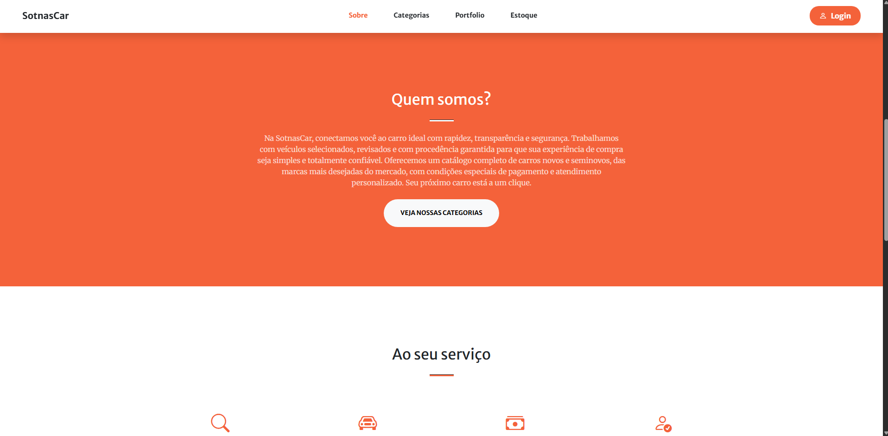

### 🚗 Categorias
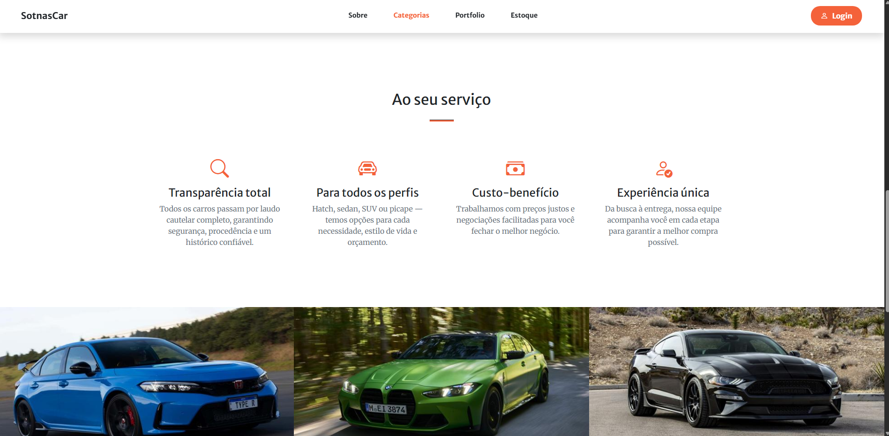

### 🖼️ Portfólio


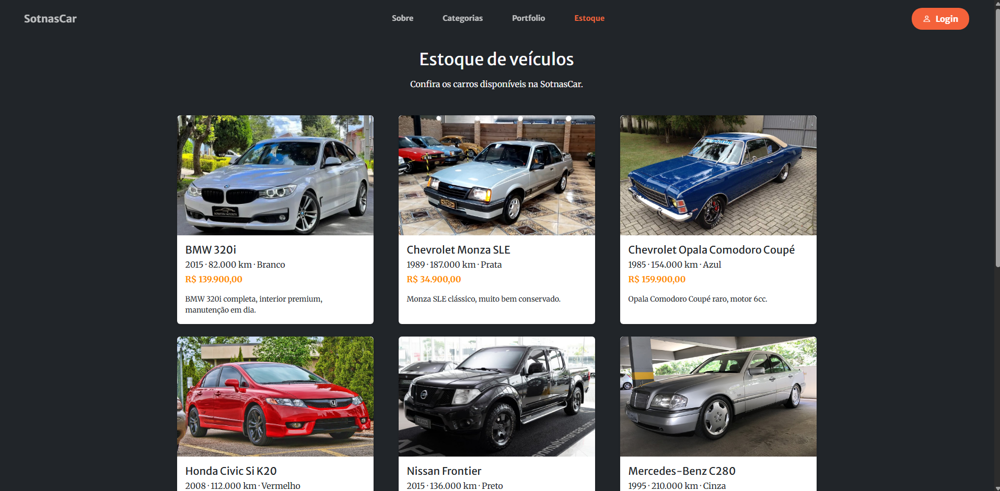

### 🚘 Estoque
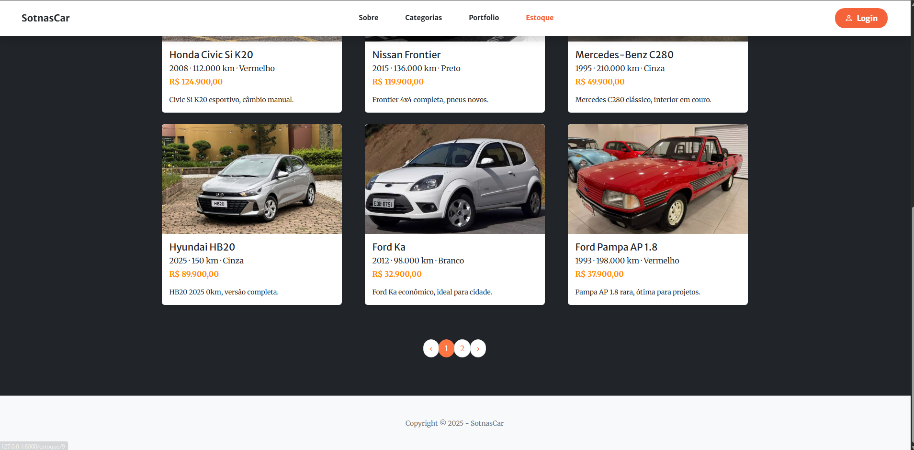
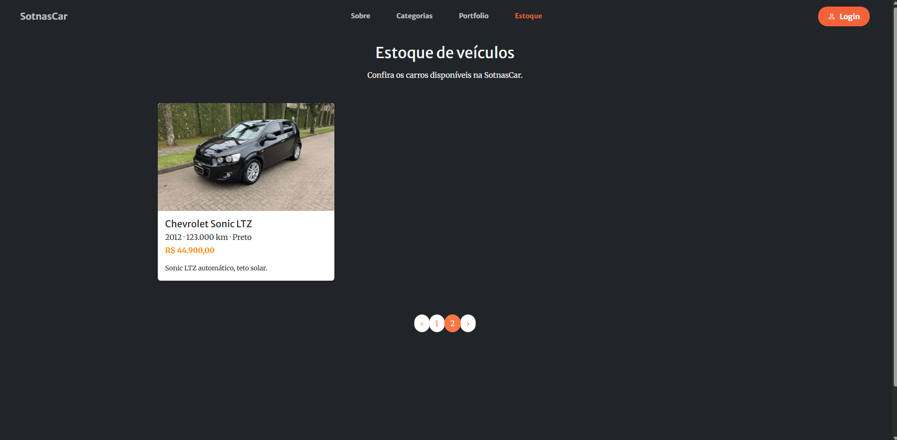

### 🔐 Login
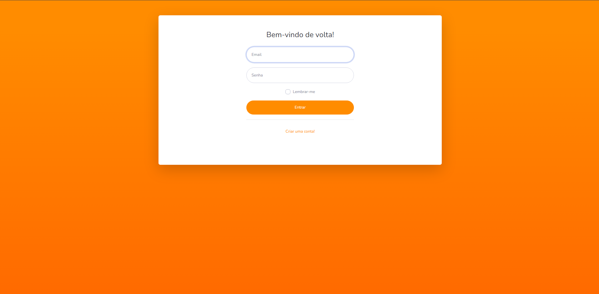

### 📝 Registro
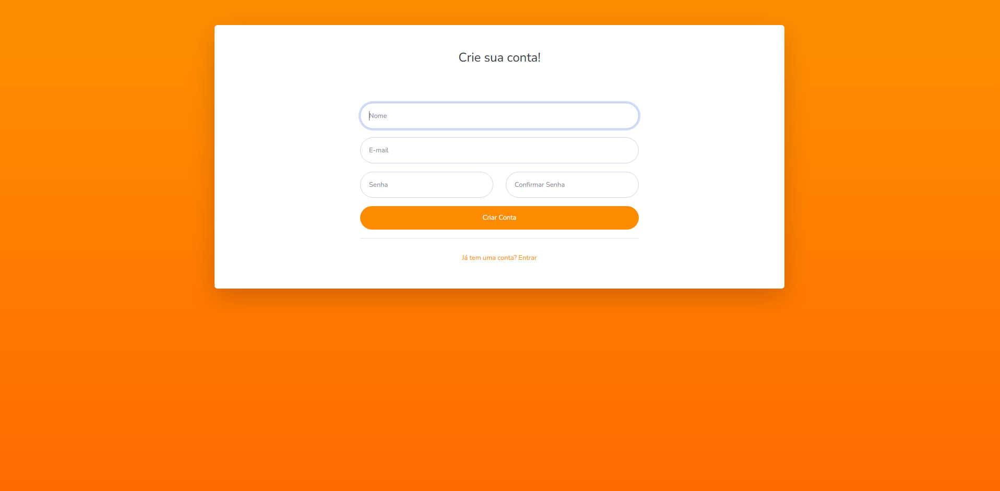

---

## 🧭 Área Administrativa

### 📊 Dashboard
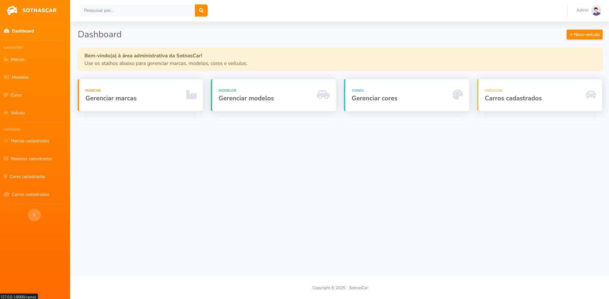

---

### 🏷️ Marcas

#### ➕ Criar Marca
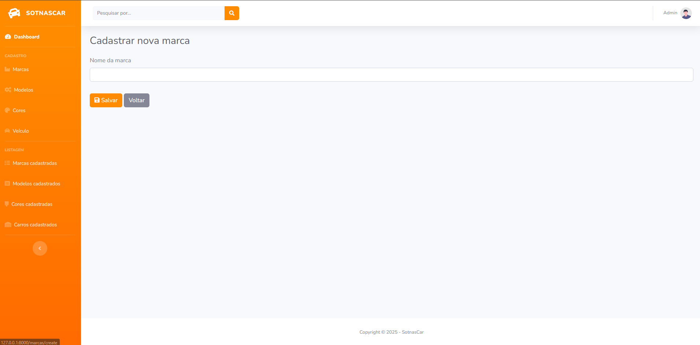

#### 📋 Listagem de Marcas
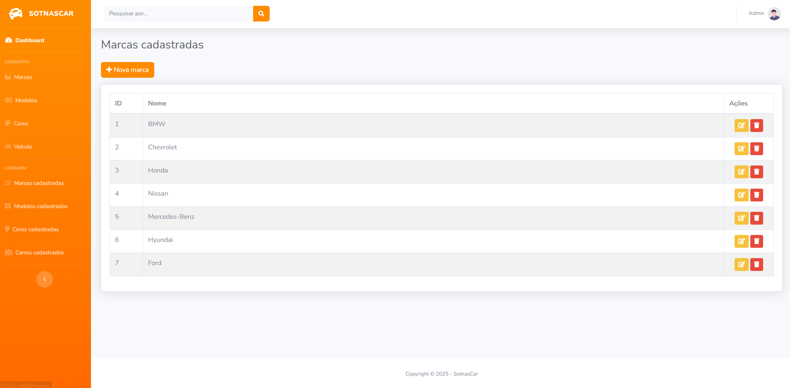

---

### 🚗 Modelos

#### ➕ Criar Modelo
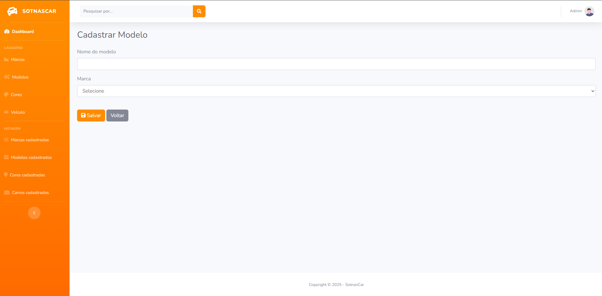

#### 📋 Modelos Cadastrados


---

### 🎨 Cores

#### ➕ Criar Cor
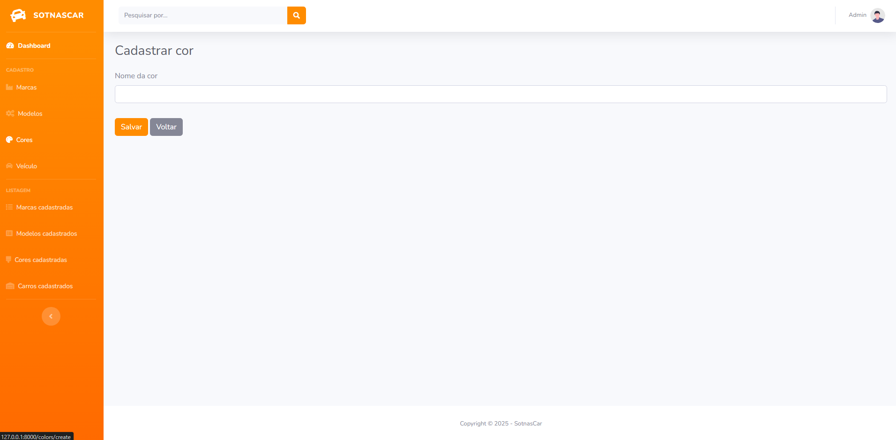

#### 📋 Cores Cadastradas
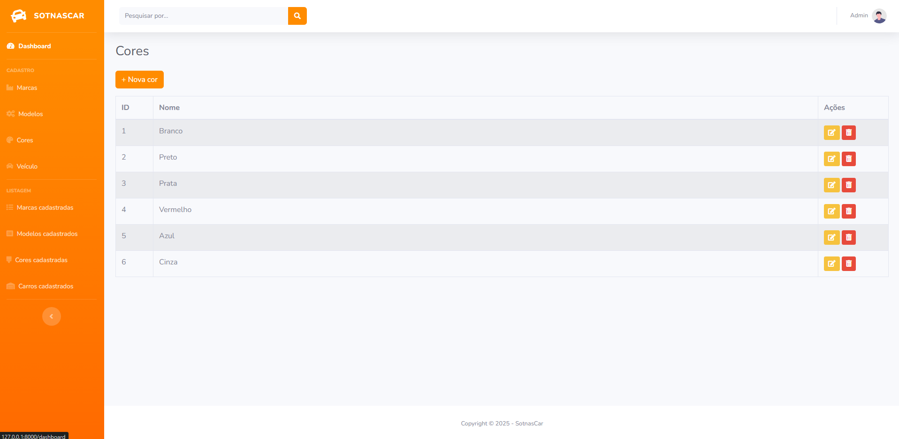

---

### 🚘 Veículos

#### ➕ Criar Veículo
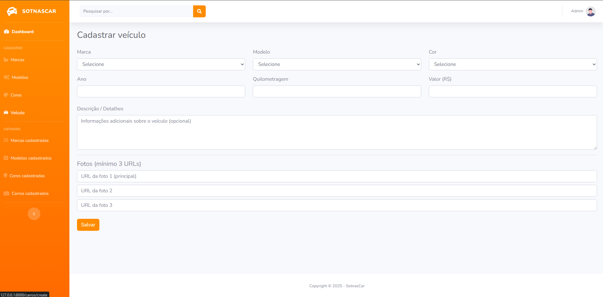

#### 📋 Veículos Cadastrados
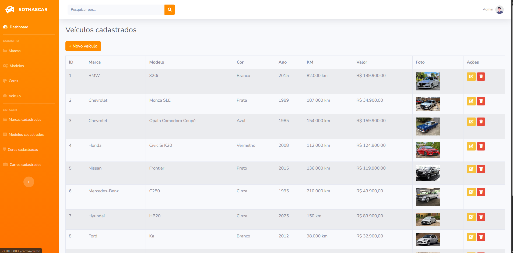

---

## Como rodar o projeto

1. **Baixe/clonar o projeto**
   - Faça o download dos arquivos do projeto ou clone o repositório.

2. **Suba o banco de dados**
   - Crie um banco de dados com o nome: `sotnascar`.

3. **Execute o migrate fresh**
   - Rode um *migrate fresh* para subir todas as tabelas do zero.  
     ```bash
     php artisan migrate:fresh
     ```

4. **Importe o conteúdo do `sql.txt`**
   - Abra o arquivo `sql.txt` que está na raiz do projeto.
   - Copie todos os comandos SQL.
   - Cole e execute esses comandos no banco de dados `sotnascar`.

5. **Suba o projeto**
   - Inicie o servidor da aplicação:
     ```bash
     php artisan serve
     ```
   - Acesse o projeto no navegador pelo endereço informado (ex.: `http://localhost:8000`).

---

## Login padrão

Use as seguintes credenciais para acessar o sistema:

- **Login:** `admin@gmail.com`  
- **Senha:** `SOTnas@123`

---

## Problemas com o login?

Caso o login apresente algum problema:

- Você pode **criar um novo usuário** diretamente pela **tela de registro** do sistema.

---
